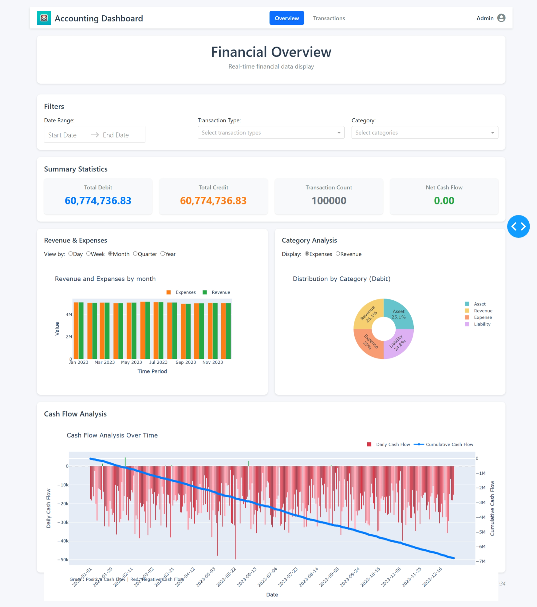
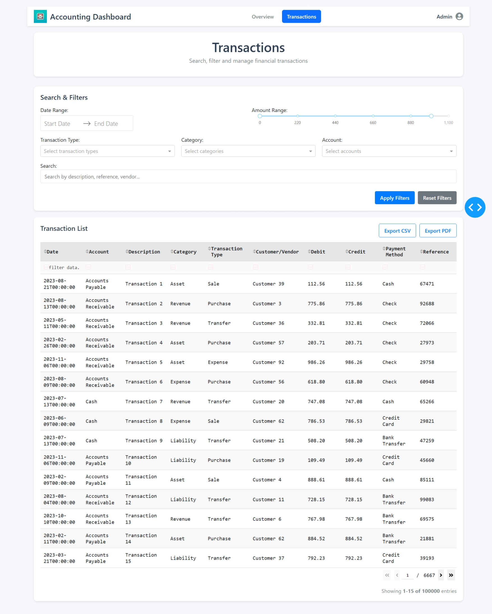

# Accounting SaaS Dashboard

## ❗ This is an assignment that I applied for a Prompt Engineering position. Take a look at [my submission](docs/subbmission.MD)

## Overview

This is a web-based accounting dashboard application built with Dash and Python. The dashboard provides real-time visualization and analysis of financial data, helping users to monitor their financial status, track transactions, and gain insights into their financial health.

## Features

- **Financial Overview Dashboard**: Visualizes key financial metrics including:
  - Summary statistics (revenue, expenses, profit)
  - Revenue vs. Expense charts
  - Category-based expense breakdown
  - Cash flow analysis

- **Transaction Management**: 
  - View detailed transaction records
  - Filter transactions by date, category, and amount
  - Search functionality for quick access to specific transactions

- **Interactive Data Visualization**:
  - Dynamic charts and graphs
  - Responsive design for various screen sizes
  - Real-time data updates

## Project Structure

```
accounting-saas-dashboard/
├── assets/                  # Static assets (CSS, images)
├── callbacks/               # Dash callback functions
│   ├── overview_callbacks.py
│   └── transactions_callbacks.py
├── components/              # Reusable UI components
│   ├── charts.py
│   ├── header.py
│   └── summary_stats.py
├── data/                    # Data files
│   └── financial_accounting.csv
├── layouts/                 # Page layouts
│   ├── overview_dashboard.py
│   └── transactions.py
├── utils/                   # Utility functions
│   └── data_processing.py
├── main.py                  # Application entry point
├── requirements.txt         # Project dependencies
└── README.MD                # Project documentation
```

## Installation

1. Clone the repository:
   ```
   git clone <repository-url>
   cd accounting-saas-dashboard
   ```

2. Install the required dependencies:
   ```
   pip install -r requirements.txt
   ```

3. Run the application:
   ```
   python app.py
   ```

4. Open your web browser and navigate to:
   ```
   http://127.0.0.1:8050/
   ```

## Data Format
The financial dataset used in this project was obtained from [Kaggle - Financial Accounting Dataset](https://www.kaggle.com/datasets/jazidesigns/financial-accounting).
The application expects financial data in CSV format with the following structure:
- Transaction date
- Account information
- Debit and Credit amounts
- Transaction categories
- Description

A sample data file is provided in the `data/` directory.

## Screenshot

*Overview Dashboard showing key financial metrics and trends*

 
*Transaction search interface with filtering capabilities*


## License

This project is licensed under the terms included in the LICENCE file.

## Contributing

Contributions are welcome! Please feel free to submit a Pull Request.
